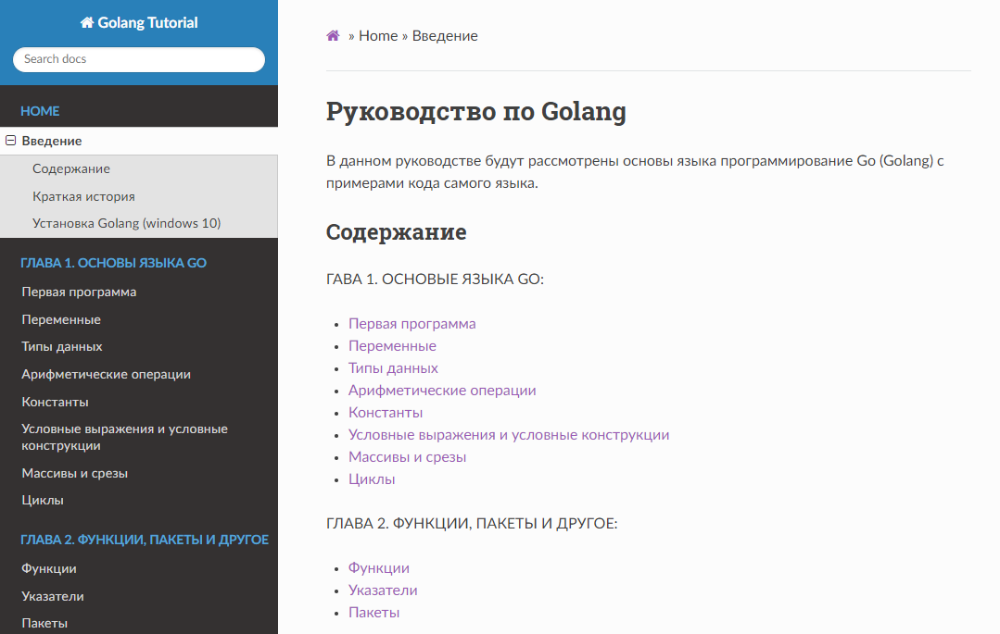

# Руководство по Golang

Данное руководство предназначено для тех, кто изучает программировани и хочет познакомиться с азами языка программирования Golang (Go).
[GolangTutorial](https://genfps.github.io/GolangTutorial/)



## Требования

- Python 3
- pipenv

## Как запустить проект на локальном устройстве

Для того чтобы запустить проект, нужно установить MkDocs. Для этого необходимо ввести следующую команду в cmd:

```
pip install mkdocs
```

Далее, убедитесь, что вы находитесь в том же каталоге, что и конфигурационный файл `mkdocs.yml`, а затем, запустите сервер, выполнив команду:

```
mkdocs serve
```

Откройте `http://127.0.0.1:8000/` в своем браузере и вы увидите домашнюю страницу данного проекта.

## Расширения

В данном проекте уже подключена библиотека **MathJax** для написания математических формул.

## Завершение

Для того, чтобы закрыть проект, нужно нажать сочетание клавиш `Ctrl+c`. В командной строке должна появиться следующая надпись:

```
INFO     -  Shutting down...
```
