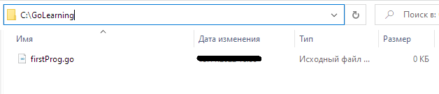
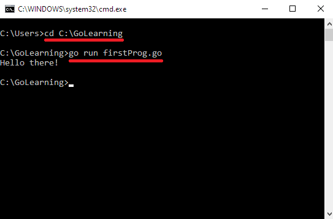
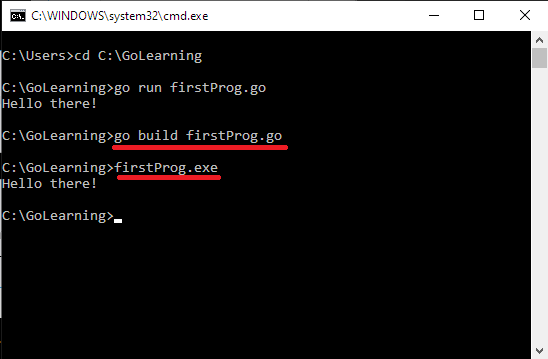

# Первая программа на Go

Создадим первую программу. Для написания кода потребуется любой текстовый редактор на ваш выбор (отлично подойдет Visual Studio Code).

Как правило, изучая тот или иной язык программирования, первой программой является "Hello, World!", которая просто выводит в консоль строку `Hello, World!`. Давайте внесем незначительные изменения в данную программу и напишем её с помощью Go.

## Создание программы

Определим место хранения первой программы с исходным кодом. В данном случае это будет **C:\GoLearning**. В папке **GoLearning** создадим новый файл с расширением .go, например, **firstProg.go**.



Откроем данный файл с помощью любого текстового редактора и напишем следующий код:

```
package main

import "fmt"

func main() {
    fmt.Println("Hello there!")
}
```

Теперь давайте разберем, что же мы написали.

Программа на языке Go определяется в виде пакетов. Программный код должен быть определен в каком-то определенном пакете. Поэтому в самом начале файла с помощью оператора **package** указывается к какому пакету будет принадлежать файл. В данном случае это пакет main (`package main`). Причем(**!**) в любом проекте должен быть обязательно пакет main. Запуск программы начинается именно с этого пакета.

Далее идет пустая строка. Go не обращает внимания на подобные строки (как и комментарии, но об этом позже). Однако, мы их используем, чтобы облегчить себе чтение программы.

`import "fmt"` - означает, что мы подключаем пакет **fmt**. Так как в нашей программе мы будем выводить сообщение на консоль, то для этого потребуется функция **Println()**, которая определена в пакете **fmt**. Слово (а точнее - директива) **import** позволяет подключать данный пакет.

`func main() {}` - это главная функция любой программы на Go. Имя **main** является особенным, поэтому все, что выполняется в программе, выполняется именно в функции main.

`fmt.Println("Hello there!")` - здесь мы выводим уже то, что нам нужно, используя встроенную функцию **Println()** из пакета **fmt**. В нашем случае функция выводит на консоль строку `Hello there!`.

## Выполнение программы

Для того, чтобы запустить нашу программу, необходимо открыть командную строку и перейти в ней с помощью команды **cd** к папке (директории), где хранится файл **firstProg.go**. В данном случае это **C:\GoLearning**:

```
cd C:\GoLearning
```

После того, как мы оказались в нужной директории, необходимо будет ввести команду:

```
go run firstProg.go
```

В результате мы запустим нашу программу и получим результат. Общая картина должны выглядеть следующим образом:



Однако, в данном случае мы выполняем, но не компилируем программу в отдельный исполняемый файл. Для компиляции выполним следующую команду:

```
go build firstProg.go
```

После выполнения этой команды в папке с исходным файлом появится еще один файл, который будет называться **firstProg.exe** и который мы можем запускать. После этого, опять же, мы можем выполнить программу, запустив в консоли созданный файл:


