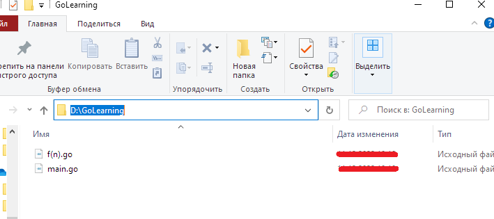
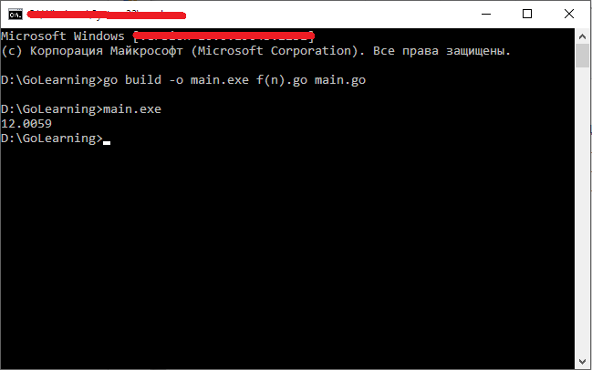
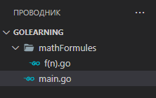
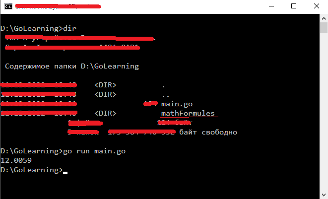

# Пакеты

Пакет Go состоит из Go-файлов, расположенных в одной и той же директории, в начале которых имеется одинаковое выражение `package`. Пакеты, подключаемые к программам, позволяют расширять их возможности. Некоторые пакеты входят в состав стандартной библиотеки Go. А это значит, что они, если вы пользуетесь Go, уже у вас установлены.

Код пакета располагается в одном или нескольких файлах с расширением go. Для определения пакета применяется ключевое слово package. Например:

```
package main
import "fmt"

func main() {

    fmt.Println("Hello there")
}
```

В данном примере пакет называется **main**. Определение пакета должно идти в начале файла.

Существеют два типа пакетов: исполняемые - **executable** и библиотеки **reusable**. Для создания исполняемых файлов пакет должен иметь имя **main**. Все остальные пакеты не являются исполняемыми. При этом пакет **main** должен содержать функцию **main**, которая является входной точкой в приложение.

## Импорт пакетов

Для использования уже готовых пакетов мы используем оператор **import**. Например, в примере мы подключили пакет `"fmt"`, в котором есть функции **Print()**, **Printf()**, **Println()**, **Scan()** и т.д. Соответственно чтобы использовать эти функции, необходимо импортировать пакет `fmt`:

```
import "fmt"
```

Нередко программы подключают (а в основном так и делают) сразу несколько пакетов. В этом случае можно импортировать каждый пакет:

```
import "fmt"
import "bufio"
import "math"
```

Однако запись в таком виде очень громоздка, поэтому существет возможность сокращенного импорта пактов:

```
import (
    "fmt"
    "bufio"
    "math"
)
```

Подключение пакетов значительно расширяет функциональность и возможность кода в Go. Так, например, пакет `"math"` предоставляет большую возможность в написании (интерпретировании) математических формул. Например, следующая мат. формула:

$$
f(n) = \sqrt[2]{n^5 + 4n^2 + 2} + \frac{\pi^2}{2} \times \log^2_{2}{n}
$$

Будет выглядеть следующим образом:

```
func f(n float64) float64 {
	formulaP1 := math.Sqrt(math.Pow(n, 5) + 4*math.Pow(n, 2) + 2)
	formulaP2 := math.Pow(math.Pi, 2)/2 * math.Pow(math.Log2(n), 2)

	return formulaP1 + formulaP2
}
```

Первая часть (`formulaP1`) — $f(n) = \sqrt[2]{n^5 + 4n^2 + 2}$

Вторая часть (`formulaP2`) — $\frac{\pi^2}{2} \times \log^2_{2}{n}$

Полный список встроенных пакетов в Go можно найти по [тут](https://pkg.go.dev/std).

## Пакет из нескольких файлов.

Как уже писалось ранее, один пакет может состоять из нескольких фалов. Давайте протестируем пример выше, но функцию, которую мы написали (`f(n)`) будет в другом файле:



Т.е. в файле **f(n).go** будет этот фрагмент кода (функция):

```
package main
import "math"

func f(n float64) float64 {
	formulaP1 := math.Sqrt(math.Pow(n, 5) + 4*math.Pow(n, 2) + 2)
	formulaP2 := math.Pow(math.Pi, 2)/2 * math.Pow(math.Log2(n), 2)

	return formulaP1 + formulaP2
}
```

А файл main.go будет исполняемым, в которой мы будем вызывать функцию **f(n)** из файла **f(n).go**:

```
package main
import "fmt"


func main() {
	result := f(2)              // 2 - входной параметр для нашей функции
	fmt.Printf("%.4f", result)
}
```

_Примечание: `"%.4f"` означает количество выводимых чисел после запятой для типов `float32` и `float64`. Данная надпись используется только в функции вида `Printf()`._

Таким образом, оба файла принадлежать пакету **main** (файлов, конечно, может быть больше).

Далее необходимо скомпилировать из этих двух файлов программу. Для этого прейдетм к консоле к папке наших файлов и выполним следующую команду:

```
go build -o main.exe f(n).go main.go
```

Флаг **-o** указывает, как будет называться выходной файл - в данном случае это **main.exe**. Затем идут все компилируемые файлы (**f(n).go**, **main.go**). После выполнения этой команды будет создан файл main.exe, который мы сможем запустить в консоли:



И посе запуска **main.exe** мы получим результат выполненной программы.

## Файлы из разных пакетов

Теперь рассмотрим такую ситуацию, где файлы нашей программы разделены по разным пакетам (т.е. находятся в разных папках/директориях). Например определим в папке нашего проекта каталог (папку) **mathFormules**. Т.е. наша рабочая область в среде разраюотки будет выглядеть следующим образом:

{ width="200" height="200" style="display: block; margin: 0 auto"}

Код файла **f(n).go** принадлежит пакету **mathFormules**. Код программы будет выглядеть следующим образом:

```
package mathFormules
import "math"

func F(n float64) float64 {
	formulaP1 := math.Sqrt(math.Pow(n, 5) + 4*math.Pow(n, 2) + 2)
	formulaP2 := math.Pow(math.Pi, 2)/2 * math.Pow(math.Log2(n), 2)

	return formulaP1 + formulaP2
}
```

Важно отметить, что название функции из другого пакета должа начинаться с заглавной букы (`F(n float64)`), т.к. благодаря этому эта функция будет видна в других пакетах.

Ну и тобы использовать функцию **f()**, надо импортировать этот пакет в файле main.go:

```
package main
import (
	"fmt"
	"./mathFormules"
)

func main() {
	fmt.Printf("%.4f", mathFormules.F(2))
}
```

Путь "./mathFormules" указывает на то, что пакет находится в папке mathFormules.

Компиляция и выполнение программы осуществляется также как и ранее без необходимости указания всех файлов из других пакетов:


