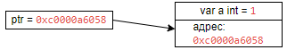

# Указатели

Указатели — это переменные, которые указывают на адрес других переменных. Они объявляются почти как обычные переменные, за исключение, что перед типом данных ставится символ звездочки `*`. Например, определение указателя на объект типа **int**:

```
var ptr *int
```

Данному указателю можно присвоить адрес переменной типа **int**. Для получение адреса применяется операция **&**, после которой указывается имя переменной (**&a**):

```
package main
import "fmt"

func main() {
    var a int = 1       // определяем переменную
    var ptr *int          // определяем указатель

    ptr = &a              // указатель получает адрес переменной
    fmt.Println(ptr)      // значение самого указателя - адрес переменной a
}
```

В данном примере указатель **ptr** хранит адрес переменной **a**. Что важно, переменная **a** имеет тип **int**, и указатель **ptr** указывает именно на объект типа **int**. То есть должно быть соответствие по типу. И если мы попробуем вывести адрес переменной на консоль, то увидим, что он представляет шестнадцатеричное значение:

```
0xc0000a6058
```

В каждом случае адрес может отличаться, но в текущем примере, машинный адрес переменной **a** - `0xc0000a6058`. Таким образом, в памяти комьютера есть адрес `0xc0000a6058` по которому распологается переменная **a**.

{ width="300" height="200" style="display: block; margin: 0 auto" }

## Оператор разименования

По адресу, который хранит указатель, мы получить значение переменной **a**. Для этого применяется операция `*` (операция разыменования). Результатом этой операции является значение переменной, на которую назначен указатель. Если мы применим эту операцию, то получим значение переменной **a**:

```
package main
import "fmt"

func main() {
    var a int = 1
    var ptr *int = &a

    fmt.Println("Адрес переменной а:", ptr)     // Адрес переменной а: 0xc000018088
	fmt.Println("Значение переменной а:", *ptr)	// Значение переменной а: 1
```

Более того, через указатель с помощью оператора разименования мы можем изменить значение переменной, на который указывает наш `ptr`:

```
package main
import "fmt"

func main() {
    var a int = 1
    var ptr *int = &a

	*ptr = 5
	fmt.Println("Значение переменной а:", a)	// Значение переменной а: 5
}
```

Также при объявлении указетеля, можно использовать сокразенную форму:

```
package main
import "fmt"

func main() {
    var b int = 2
    ptr := &b

	fmt.Println("Адрес b:", ptr)		// Адрес b: 0xc000018088
	fmt.Println("Значение b:", *ptr)	// Значение b: 2
}
```

## Пустые указатели

В случае, есил указателю не присвоить адрес какой-либо переменной (или любого другого объекта), то он будет иметь пустое значение (**nil**). При попытке получить значение такого указателя мы получим ошибку:

```
package main
import "fmt"

func main() {
    var ptr *string

	fmt.Println("Значение:", *ptr)	// runtime error: invalid memory address or nil pointer dereference
}
```

Чтобы избежать этой ошибки в Go часто используют следующую коснтрукцию, которая проверяет указатель на наличие адреса:

```
package main
import "fmt"

func main() {
    var ptr *string

	if ptr != nil {
		fmt.Println("Значение:", *ptr)
	} else {
		fmt.Println("Указатель ptr имеет nil значение!")
	}
}
```

## Функция new

Встроенная функция new выделяет память (создает неименованную переменную и возваращет указатель на ее значение). В эту функцию передается тип, объект которого надо создать. Функция возвращает указатель на созданный объект:

```
package main
import "fmt"

func main() {
    ptr := new(int)

	fmt.Println("Адрес:", ptr)	// Адрес: 0xc0000a6058
	fmt.Println("Значение до присвоения:", *ptr)	// Значение до присвоения: 0

	*ptr = 10
	fmt.Println("Значение после присвоения:", *ptr)	// Значение после присвоения: 10
}
```

В этом примере указатель ptr будет иметь тип `*int`, поскольку он указывает на объект типа `int`. Созданный объект `ptr` имеет значение по умлочанию (для `int` это 0).

По сути, объект, созданный с помощью функции **new()**, ничем не отличается от обычной переменной. Единственное что, чтобы обратиться к этому объекту, наприме, получить или изменить его адрес, необходимо использовать указатель.
