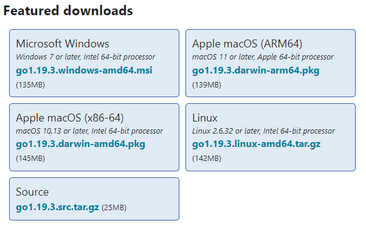
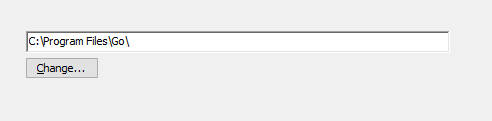
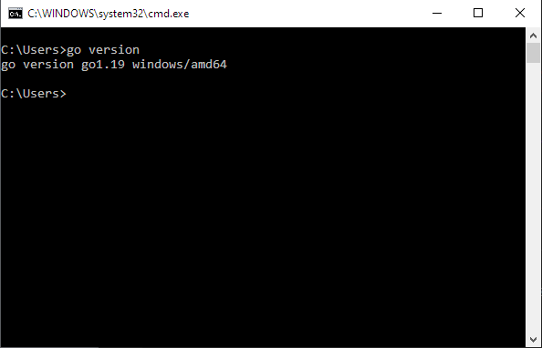

# Руководство по Golang

В данном руководстве будут рассмотрены основы языка программирование Go (Golang) с примерами кода самого языка.

## Содержание

ГЛАВА 1. ОСНОВЫ ЯЗЫКА GO:

- [Первая программа](chapter_1/firstProg.md)
- [Переменные](chapter_1/var.md)
- [Типы данных](chapter_1/typeOf.md)
- [Арифметические операции](chapter_1/arith.md)
- [Константы](chapter_1/const.md)
- [Условные выражения и условные конструкции](chapter_1/condit.md)
- [Массивы и срезы](chapter_1/array.md)
- [Циклы](chapter_1/cicle.md)

ГЛАВА 2. ФУНКЦИИ, ПАКЕТЫ И ДРУГОЕ:

- [Функции](chapter_2/function.md)
- [Указатели](chapter_2/pointers.md)
- [Пакеты](chapter_2/packages.md)

## Краткая история

Язык Go — это язык программирования, изначально разработанный в Google в 2007 году Робертом Гриземером, Робом Пайком и Кеном Томпсоном. Это статически типизированный язык с синтаксисом, подобным языку C. Он обеспечивает безопасность типов, возможности динамической типизации, множество продвинутых встроенных типов, таких как массивы переменной длины и карты ключ-значение, а также Go обладает таким функционалом как сборщик мусора. Golang также предоставляет богатую стандартную библиотеку. Язык программирования Go был запущен в ноябре 2009 года и используется в некоторых производственных системах Google.

Go является кроссплатформенным языком программирования, он позволяет создавать программы под различные операционные системы - Windows, Mac OS, Linux. Код обладает переносимостью: программы, написанные для одной из этих операционных систем, могут быть легко с перекомпиляцией перенесены на другую ОС.

В настоящее время Go применяется в различных сферах. В частности, среди известных проектов, которые применяют Go, можно найти следующие: Google, Dropbox, Netflix, Kubernetes, Docker, Twitch, Uber.

## Установка Golang (windows 10)

Скачать установочные файлы можно (и нужно) с официального [сайта](https://go.dev/dl/). По этому адресу мы видим пакеты установщиков для различных операционных систем.

Выбираем установщик пакетов для Microsoft Winows и идем дальше.

Далее, при загрузке и запуске установщика для Windows откроется следующее окно:

После того, как мы примем лицензионное соглашение отобразится окно для выбора места установки.

По умолчанию установщик установит Go в папку Program Files или Program Files (x86). Вы можете оставить текующее место установки или же изменить местоположение по мере необходиомости. Нажимаем кнопку "Install".

После установки, для того чтобы убедится, что программа стоит на вашем компьютере нужно сделать следующее:

1. Нажать сочетание клавиш Win+R
2. В открывшемся окне "Выполнить" ввести cmd и нажать Enter (откроется командная строка)
3. В командной строке нужно будет ввести следующую команду: **go version**

Если после этого выводится версия Go, то установка прошла успешно и данный язык программирования стоит на вашем ПК.
